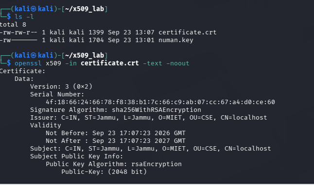
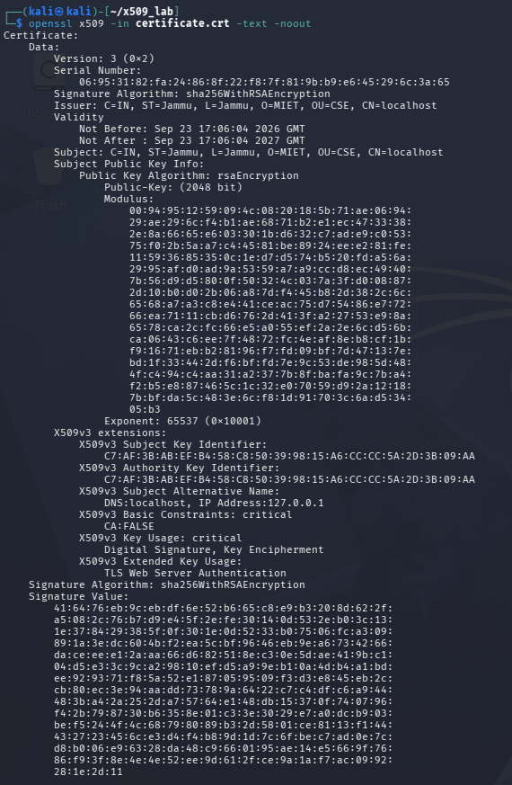
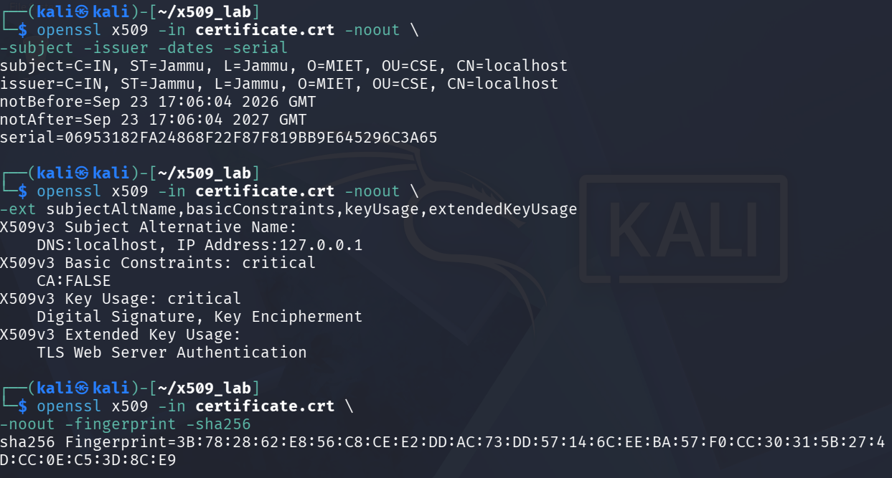
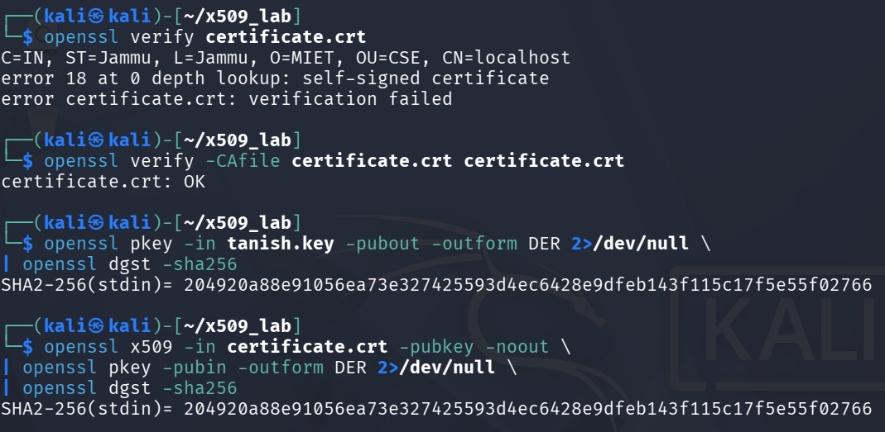
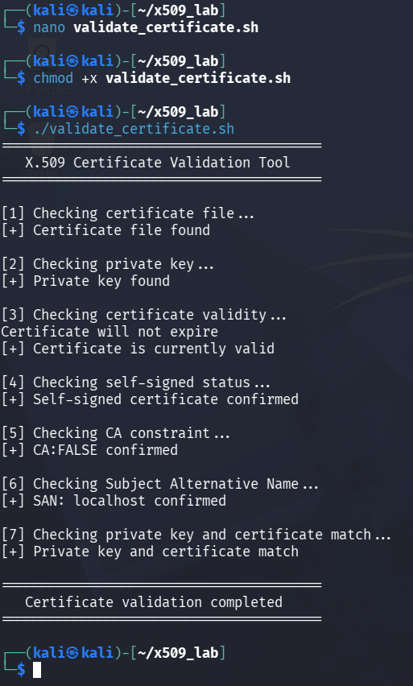

# Experiment 4: X.509 Self-Signed Digital Certificate

# Experiment 4: X.509 Self-Signed Digital Certificate

## Aim

To generate, inspect, and verify a self-signed X.509 digital certificate using OpenSSL and to validate the certificate, its extensions, and its corresponding private key.

---

## Objective

The objectives of this experiment are:

- To generate a 2048-bit RSA private key using OpenSSL.
- To validate the generated private key.
- To generate a self-signed X.509 certificate.
- To configure certificate properties such as Subject, Subject Alternative Name (SAN), Key Usage, and Extended Key Usage.
- To inspect the contents and extensions of the certificate.
- To generate a SHA-256 certificate fingerprint.
- To verify the certificate with and without explicit trust.
- To confirm that the certificate public key corresponds to the generated private key.
- To develop an automated certificate validation script as an improvement.

---

## Requirements

- Kali Linux
- OpenSSL
- Linux Terminal
- GitHub
- Basic knowledge of Linux and OpenSSL commands

---

## Theory

### X.509 Digital Certificate

An X.509 certificate is a digital certificate used to associate a public key with an identity. It contains information such as the subject, issuer, validity period, public key, serial number, and certificate extensions.

In this experiment, a self-signed X.509 certificate was generated using OpenSSL.

### Self-Signed Certificate

A self-signed certificate is a certificate that is signed using its own private key rather than being signed by an external Certificate Authority.

Since the certificate generated in this experiment is self-signed, its Subject and Issuer contain the same identity information.

### Public Key and Private Key

The private key is used for cryptographic operations and must be kept protected. The corresponding public key is included in the digital certificate and can be distributed.

---

# Procedure

## Step 1: OpenSSL Setup

The OpenSSL installation was checked and a separate working directory was created for the experiment.

The working directory was used to store the private key and certificate generated during the experiment.

---

## Step 2: RSA Private Key Generation and Validation

A 2048-bit RSA private key named `tanish.key` was generated.

The generated private key was then validated to ensure that the key was valid and usable.

The validation produced the result:

**Key is valid**

---

## Step 3: Self-Signed X.509 Certificate Generation

A self-signed X.509 certificate named `certificate.crt` was generated using the RSA private key.

The certificate was configured with the following identity information:

- Country: IN
- State: Jammu
- Locality: Jammu
- Organization: MIET
- Organizational Unit: CSE
- Common Name: localhost

The certificate was configured with a validity period of 365 days.

The following certificate extensions were also configured:

- Subject Alternative Name
- Basic Constraints
- Key Usage
- Extended Key Usage

---

## Step 4: Certificate Inspection

The generated certificate was inspected to examine its internal information.

The inspection included:

- X.509 version
- Serial number
- Signature algorithm
- Issuer
- Subject
- Validity period
- RSA public key
- Certificate extensions
- Certificate signature

The certificate was identified as an X.509 Version 3 certificate containing a 2048-bit RSA public key.

---

## Step 5: Certificate Details, Extensions and Fingerprint

Important certificate information was examined, including the Subject, Issuer, validity dates, and serial number.

The certificate extensions were also checked. The configured extensions included:

- `DNS:localhost`
- `IP Address:127.0.0.1`
- `CA:FALSE`
- `Digital Signature`
- `Key Encipherment`
- `TLS Web Server Authentication`

A SHA-256 fingerprint was generated for the certificate.

The Subject and Issuer were found to contain the same information, confirming the self-signed nature of the certificate.

---

## Step 6: Certificate Verification and Key Matching

The certificate was first verified without explicitly trusting it. The verification produced a self-signed certificate error, which was expected because the certificate was not issued by a trusted Certificate Authority.

The certificate was then verified by explicitly using the certificate itself as the trusted certificate. The verification result was:

**certificate.crt: OK**

The public key derived from the private key was also compared with the public key contained in the certificate.

Both SHA-256 digests were identical:

`204920a88e91056ea73e327425593d4ec6428e9dfeb143f115c17f5e55f02766`

This confirmed that the certificate public key corresponds to the private key `tanish.key`.

---

# Improvement: Automated Certificate Validation

## Description

As an improvement to the basic experiment, a Bash-based **X.509 Certificate Validation Tool** was developed.

In the original procedure, different certificate properties were checked individually using separate OpenSSL commands. The improvement automates multiple checks in a single execution.

The validation script checks:

1. Certificate file availability
2. Private key availability
3. Certificate validity
4. Self-signed status
5. CA constraint
6. Subject Alternative Name
7. Private key and certificate matching

The improvement makes the validation process more systematic, repeatable, and easier to perform.

The script is available in the `Codes` folder as:

**`Validate_certificate.sh`**

---

# Files Included

## Code Files

### [`Commands.sh`](Codes/Commands.sh)

Contains the OpenSSL commands used throughout the experiment along with comments explaining their purpose.

### [`Validate_certificate.sh`](Codes/Validate_certificate.sh)

Contains the Bash script developed as the improvement to automate certificate validation.

---

## Output Files

The `Outputs` folder contains:

- `ss1.png` — OpenSSL setup
- `ss2.png` — Private key generation and validation
- `ss3.png` — Self-signed certificate generation
- `ss4.png` — Certificate inspection
- `ss5.png` — Certificate details, extensions and fingerprint
- `ss6.png` — Certificate verification and key matching
- `ss7.png` — Automated certificate validation
- `certificate.crt` — Generated X.509 certificate
- `tanish.key` — RSA private key used for certificate generation

---

# Result

A 2048-bit RSA private key and a self-signed X.509 digital certificate were generated using OpenSSL.

The certificate was successfully inspected, its extensions and SHA-256 fingerprint were examined, and its verification behavior was tested.

The certificate public key was also confirmed to correspond to the generated private key.

As an improvement, an automated Bash-based certificate validation tool was developed and successfully used to perform multiple certificate checks in a single execution.

---

# Conclusion

The experiment demonstrated the generation, inspection, and verification of a self-signed X.509 digital certificate using OpenSSL.

The relationship between the private key and certificate public key was verified through SHA-256 digest comparison. The automated validation script further improved the experiment by combining multiple certificate checks into a single repeatable process.
